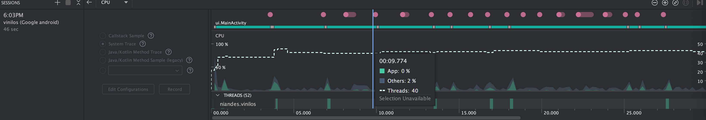
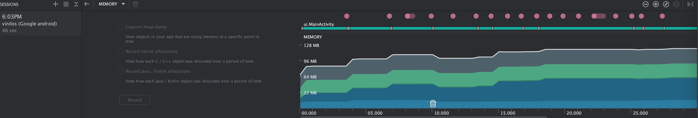

# 🎵 Aplicación Vinilos

Una aplicación móvil para gestionar y explorar discos de vinilo, construida siguiendo prácticas modernas de desarrollo Android.

---

## 🛠️ Arquitectura

La aplicación implementa el patrón **MVVM** (Model-View-ViewModel) y principios de **Clean Architecture**, proporcionando una clara separación de responsabilidades y facilitando la mantenibilidad y el testeo.

---

## 📦 Estructura y Componentes del Proyecto

### Capa de Datos

1. **Modelos**
   - Ubicados en `app/src/main/java/com/uniandes/vinilos/models/`
   - Definen las estructuras de datos utilizadas en la aplicación
   - Ejemplo:
   ```kotlin
   data class Album(
       val id: Int,
       val name: String,
       val cover: String,
       val releaseDate: String,
       val description: String,
       val genre: String,
       val recordLabel: String,
       val tracks: List<Track>,
       val comments: List<Comment>,
       val performers: List<Performer>
   )
   ```

2. **DAOs (Objetos de Acceso a Datos)**
   - Ubicados en `app/src/main/java/com/uniandes/vinilos/data/dao/`
   - Definen interfaces para operaciones de datos
   - Implementados por DAOs de API que utilizan Retrofit
   - Ejemplo:
   ```kotlin
   interface AlbumDao {
       suspend fun getAllAlbums(): List<Album>
       suspend fun getAlbumById(id: Int): Album?
       suspend fun getAlbumTracks(albumId: Int): List<Track>
   }

   @ActivityRetainedScoped
   class ApiAlbumDao @Inject constructor(
       private val albumService: AlbumService
   ) : AlbumDao {
       override suspend fun getAllAlbums(): List<Album> {
           return try {
               val response = albumService.getAlbums()
               if (response.isSuccessful) {
                   response.body() ?: emptyList()
               } else {
                   emptyList()
               }
           } catch (e: Exception) {
               emptyList()
           }
       }
   }
   ```

3. **Servicios de Red**
   - Ubicados en `app/src/main/java/com/uniandes/vinilos/network/`
   - Definen endpoints de API usando Retrofit
   - Ejemplo:
   ```kotlin
   interface AlbumService {
       @GET("albums")
       suspend fun getAlbums(): Response<List<Album>>

       @GET("albums/{id}")
       suspend fun getAlbum(@Path("id") id: Int): Response<Album>

       @GET("albums/{id}/tracks")
       suspend fun getAlbumTracks(@Path("id") id: Int): Response<List<Track>>
   }
   ```

4. **Repositorios**
   - Ubicados en `app/src/main/java/com/uniandes/vinilos/data/repository/`
   - Actúan como fuente única de verdad para los datos
   - Utilizan DAOs para obtener datos de la red
   - Ejemplo:
   ```kotlin
   @Singleton
   class AlbumRepository @Inject constructor(
       private val albumDao: AlbumDao
   ) {
       suspend fun getAllAlbums(): List<Album> {
           return albumDao.getAllAlbums()
       }

       suspend fun getAlbumById(id: Int): Album? {
           return albumDao.getAlbumById(id)
       }

       suspend fun getAlbumTracks(albumId: Int): List<Track> {
           return albumDao.getAlbumTracks(albumId)
       }
   }
   ```

#### Inyección de Dependencias
- Utiliza Hilt para la inyección de dependencias
- Configuración de red en `NetworkModule.kt`:
```kotlin
@Module
@InstallIn(SingletonComponent::class)
object NetworkModule {
    private const val BASE_URL = "http://146.190.65.12:3000/"

    @Provides
    @Singleton
    fun provideRetrofit(okHttpClient: OkHttpClient): Retrofit {
        return Retrofit.Builder()
            .baseUrl(BASE_URL)
            .client(okHttpClient)
            .addConverterFactory(GsonConverterFactory.create())
            .build()
    }

    @Provides
    @Singleton
    fun provideAlbumService(retrofit: Retrofit): AlbumService {
        return retrofit.create(AlbumService::class.java)
    }
}
```

---

### Capa de UI

1. **Fragments**
   - Ubicados en `app/src/main/java/com/uniandes/vinilos/ui/fragments/`
   - Manejan el renderizado de UI y las interacciones del usuario
   - Ejemplo:
   ```kotlin
   class AlbumListFragment : Fragment() {
       private val viewModel: AlbumViewModel by viewModels()
       private lateinit var binding: FragmentAlbumListBinding
       
       override fun onCreateView(
           inflater: LayoutInflater,
           container: ViewGroup?,
           savedInstanceState: Bundle?
       ): View {
           binding = FragmentAlbumListBinding.inflate(inflater, container, false)
           return binding.root
       }
       
       override fun onViewCreated(view: View, savedInstanceState: Bundle?) {
           super.onViewCreated(view, savedInstanceState)
           setupRecyclerView()
           observeViewModel()
       }
   }
   ```

2. **ViewModels**
   - Ubicados en `app/src/main/java/com/uniandes/vinilos/ui/viewmodel/`
   - Manejan la lógica de negocio y la transformación de datos
   - Ejemplo:
   ```kotlin
   class AlbumViewModel @Inject constructor(
       private val albumRepository: AlbumRepository
   ) : ViewModel() {
       private val _albums = MutableStateFlow<List<Album>>(emptyList())
       val albums: StateFlow<List<Album>> = _albums.asStateFlow()
       
       fun loadAlbums() {
           viewModelScope.launch {
               albumRepository.getAlbums().collect { albums ->
                   _albums.value = albums
               }
           }
       }
   }
   ```

### Implementación de Navegación

La aplicación utiliza el Navigation Component con una arquitectura de actividad única:

1. **Grafo de Navegación**
   - Ubicado en `app/src/main/res/navigation/nav_graph.xml`
   - Define todos los posibles caminos de navegación
   ```xml
   <navigation xmlns:android="http://schemas.android.com/apk/res/android"
       xmlns:app="http://schemas.android.com/apk/res-auto"
       android:id="@+id/nav_graph"
       app:startDestination="@id/roleSelectionFragment">
       
       <fragment
           android:id="@+id/roleSelectionFragment"
           android:name="com.uniandes.vinilos.ui.fragments.RoleSelectionFragment"
           android:label="Seleccionar Rol">
           <action
               android:id="@+id/action_roleSelection_to_albumList"
               app:destination="@id/albumListFragment" />
       </fragment>
       
       <fragment
           android:id="@+id/albumListFragment"
           android:name="com.uniandes.vinilos.ui.fragments.AlbumListFragment"
           android:label="Álbumes">
           <action
               android:id="@+id/action_albumList_to_albumDetail"
               app:destination="@id/albumDetailFragment" />
       </fragment>
   </navigation>
   ```

2. **Navegación en Fragments**
   ```kotlin
   // Navegar al detalle del álbum
   findNavController().navigate(
       AlbumListFragmentDirections.actionAlbumListToAlbumDetail(albumId)
   )
   
   // Navegar hacia atrás
   findNavController().navigateUp()
   ```

3. **Safe Args**
   - Utilizado para navegación con tipos seguros
   - Generado por el Navigation Component
   - Ejemplo:
   ```kotlin
   // En AlbumListFragment
   val action = AlbumListFragmentDirections
       .actionAlbumListToAlbumDetail(albumId)
   findNavController().navigate(action)
   
   // En AlbumDetailFragment
   val albumId = arguments?.let { 
       AlbumDetailFragmentArgs.fromBundle(it).albumId 
   }
   ```

## Pruebas

La aplicación utiliza pruebas instrumentadas con Espresso para verificar la funcionalidad de la UI.

### Estructura de Pruebas

Las pruebas se encuentran en:
- `app/src/androidTest/java/com/uniandes/vinilos/ui/albums/`
- Utilizan Espresso para pruebas de UI
- Se enfocan en la interacción con la interfaz de usuario

### Ejemplo de Prueba con Espresso

```kotlin
@HiltAndroidTest
class AlbumListFragmentTest {
    @Test
    fun testAlbumListFragment_UIElements() {
        // Configuración
        onView(withId(R.id.visitorRole)).perform(click())
        onView(withId(R.id.continueButton)).perform(click())
        
        // Verificación
        onView(withId(R.id.albumsRecyclerView))
            .check(matches(isDisplayed()))
    }

    @Test
    fun testAlbumDetailFragment_BasicInfo() {
        // Verificar que todos los elementos básicos de información se muestran
        onView(withId(R.id.albumCoverImageView))
            .check(matches(isDisplayed()))
        onView(withId(R.id.albumTitleTextView))
            .check(matches(isDisplayed()))
        onView(withId(R.id.albumArtistTextView))
            .check(matches(isDisplayed()))
        onView(withId(R.id.albumGenreTextView))
            .check(matches(isDisplayed()))
        onView(withId(R.id.albumReleaseDateTextView))
            .check(matches(isDisplayed()))
        onView(withId(R.id.albumDescriptionTextView))
            .check(matches(isDisplayed()))
    }

    @Test
    fun testAlbumDetailFragment_TracksList() {
        // Verificar que el RecyclerView de tracks se muestra
        onView(withId(R.id.tracksRecyclerView))
            .check(matches(isDisplayed()))
            .check(matches(hasMinimumChildCount(1)))
    }

    @Test
    fun testAlbumDetailFragment_PerformersList() {
        // Verificar que el RecyclerView de performers se muestra
        onView(withId(R.id.performersRecyclerView))
            .check(matches(isDisplayed()))
            .check(matches(hasMinimumChildCount(1)))
    }
}
```

### Ejecución de Pruebas

Hay dos formas de ejecutar las pruebas:

1. **A través de la línea de comandos:**
   ```bash
   ./gradlew connectedAndroidTest
   ```

2. **A través de Android Studio:**
   - Abrir el archivo de prueba
   - Hacer clic derecho sobre el archivo o método de prueba
   - Seleccionar "Run 'NombreDelTest'"
   - También se pueden ejecutar pruebas individuales haciendo clic en el ícono de "play" junto al método de prueba

Las pruebas verifican:
1. Visualización correcta de elementos UI
2. Interacción con botones y controles
3. Navegación entre pantallas
4. Carga y visualización de datos
5. Comportamiento de listas y RecyclerViews

## Construcción de la Aplicación

### Generación de APK

1. **APK de Depuración**
   ```bash
   ./gradlew assembleDebug
   ```
   Salida: `app/build/outputs/apk/debug/app-debug.apk`

2. **APK de Lanzamiento**
   ```bash
   ./gradlew assembleRelease
   ```
   Salida: `app/build/outputs/apk/release/app-release.apk`


## 📚 Dependencias

La aplicación utiliza varias bibliotecas modernas de Android:

- **Hilt**: Inyección de dependencias
- **Retrofit**: Llamadas de red
- **Coroutines**: Programación asíncrona
- **Flow**: Flujos reactivos
- **Navigation Component**: Manejo de navegación
- **ViewBinding**: Vinculación de vistas
- **Material Design**: Componentes de UI

---

## Estructura del Proyecto

```
app/
├── src/
│   ├── main/
│   │   ├── java/com/uniandes/vinilos/
│   │   │   ├── models/          # Modelos de datos
│   │   │   ├── network/         # Servicios de API
│   │   │   ├── repository/      # Repositorios de datos
│   │   │   ├── ui/             # Componentes de UI
│   │   │   │   ├── fragments/   # Fragments
│   │   │   │   └── viewmodel/   # ViewModels
│   │   │   └── utils/          # Clases de utilidad
│   │   └── res/
│   │       ├── layout/         # Archivos de layout
│   │       └── navigation/     # Grafos de navegación
│   ├── test/                   # Pruebas unitarias
│   └── androidTest/            # Pruebas instrumentadas
```

---

## Buenas Prácticas para el Consumo de Memoria

### Perfilamiento y Monitoreo

- Se utilizó el **Android Studio Profiler** para monitorear el consumo de memoria de la aplicación durante los principales flujos de uso (navegación entre pantallas, carga de datos, etc.).
- No se detectaron fugas de memoria durante las pruebas.
- Se realizaron capturas de pantalla del profiler como evidencia del monitoreo (ver imágenes abajo).

### Microoptimizaciones implementadas

A continuación se detallan las microoptimizaciones aplicadas en la aplicación para mejorar el rendimiento y la eficiencia, junto con ejemplos de código y referencias a los archivos donde se implementan:

- **Uso de ViewHolder en RecyclerView:**
  - Se implementa el patrón ViewHolder para evitar inflar vistas innecesariamente y mejorar el rendimiento de las listas.
  - **Ejemplo:**
    ```kotlin
    class AlbumAdapter(private val albums: List<Album>) : RecyclerView.Adapter<AlbumAdapter.AlbumViewHolder>() {
        class AlbumViewHolder(itemView: View) : RecyclerView.ViewHolder(itemView) {
            // ...
        }
        // ...
    }
    ```
  - **Archivo:** `app/src/main/java/com/uniandes/vinilos/ui/adapters/AlbumAdapter.kt`

- **Carga eficiente de imágenes con Glide:**
  - Glide gestiona la memoria y el caché de imágenes, evitando cargas redundantes y liberando recursos automáticamente.
  - **Ejemplo:**
    ```kotlin
    Glide.with(context)
        .load(album.cover)
        .placeholder(R.drawable.placeholder)
        .into(binding.albumCoverImageView)
    ```
  - **Archivo:** `app/src/main/java/com/uniandes/vinilos/ui/adapters/AlbumAdapter.kt`

- **Uso de corutinas para operaciones asíncronas:**
  - Las operaciones de red y de base de datos se realizan fuera del hilo principal, evitando bloqueos de la interfaz de usuario.
  - **Ejemplo:**
    ```kotlin
    viewModelScope.launch {
        val albums = albumRepository.getAllAlbums()
        _albums.value = albums
    }
    ```
  - **Archivo:** `app/src/main/java/com/uniandes/vinilos/ui/viewmodel/AlbumViewModel.kt`

- **Liberación de recursos en onDestroy/onCleared:**
  - Se liberan recursos y referencias en los métodos adecuados para evitar fugas de memoria.
  - **Ejemplo:**
    ```kotlin
    override fun onCleared() {
        super.onCleared()
        // Liberar recursos si es necesario
    }
    ```
  - **Archivo:** `app/src/main/java/com/uniandes/vinilos/ui/viewmodel/AlbumViewModel.kt`

- **Uso de LiveData y ViewModel:**
  - Permite que la UI observe los datos de forma eficiente y reactiva, evitando recargas innecesarias y fugas de memoria.
  - **Ejemplo:**
    ```kotlin
    val albums: LiveData<List<Album>> = _albums
    ```
  - **Archivo:** `app/src/main/java/com/uniandes/vinilos/ui/viewmodel/AlbumViewModel.kt`

- **Reutilización de layouts y vistas:**
  - Se reutilizan layouts y vistas en listas para minimizar el consumo de memoria.
  - **Ejemplo:**
    ```kotlin
    override fun onCreateViewHolder(parent: ViewGroup, viewType: Int): AlbumViewHolder {
        val view = LayoutInflater.from(parent.context).inflate(R.layout.item_album, parent, false)
        return AlbumViewHolder(view)
    }
    ```
  - **Archivo:** `app/src/main/java/com/uniandes/vinilos/ui/adapters/AlbumAdapter.kt`

### Evidencia de Perfilamiento de Memoria y CPU

A continuación se presentan capturas de pantalla del profiler de Android Studio durante la ejecución de la aplicación:

#### Perfilamiento de Memoria y CPU

Se realizó un análisis de rendimiento utilizando **Android Studio Profiler** para evaluar el uso de CPU y memoria de la aplicación durante una sesión típica de uso. Los resultados obtenidos son los siguientes:

#### Resultados

- **CPU:**
  - El uso del procesador se mantuvo estable y en niveles bajos (por debajo del 50% la mayor parte del tiempo).
  - La cantidad de hilos activos fue razonable (entre 40 y 52), lo cual es normal para una aplicación Android moderna.
  - No se observaron picos ni caídas bruscas que indiquen problemas de rendimiento o bloqueos.

- **Memoria:**
  - El consumo de memoria aumentó de manera gradual, como es esperado cuando la aplicación carga datos y elementos de la interfaz.
  - No se detectaron picos ni caídas repentinas en el uso de memoria, lo que sugiere que no hay fugas de memoria ni asignaciones excesivas.
  - El uso total de memoria se mantuvo muy por debajo de los 128 MB, lo cual es excelente para una aplicación Android.

- **Conclusión:**
  - Los resultados muestran que la aplicación tiene un buen desempeño en cuanto a uso de CPU y memoria.
  - No se identificaron problemas evidentes de rendimiento ni de gestión de memoria durante la sesión de prueba.

#### Capturas de pantalla

 


### Buenas prácticas para evitar ANRs (Application Not Responding)

Para garantizar una experiencia fluida y evitar bloqueos de la aplicación (ANRs), se han implementado las siguientes buenas prácticas en el desarrollo de la app:

- **Operaciones pesadas fuera del hilo principal (UI thread):**
  - Todas las operaciones de red y acceso a base de datos se realizan utilizando corutinas, evitando así bloquear la interfaz de usuario.
  - **Ejemplo:**
    ```kotlin
    viewModelScope.launch {
        val albums = albumRepository.getAllAlbums()
        _albums.value = albums
    }
    ```
  - **Archivo:** `app/src/main/java/com/uniandes/vinilos/ui/viewmodel/AlbumViewModel.kt`

- **Carga asíncrona de imágenes:**
  - Se utiliza Glide para cargar imágenes de manera eficiente y asíncrona, evitando bloqueos en la UI.
  - **Ejemplo:**
    ```kotlin
    Glide.with(context)
        .load(album.cover)
        .placeholder(R.drawable.placeholder)
        .into(binding.albumCoverImageView)
    ```
  - **Archivo:** `app/src/main/java/com/uniandes/vinilos/ui/adapters/AlbumAdapter.kt`

- **Uso de LiveData y ViewModel:**
  - Los datos observados por la UI se gestionan de forma reactiva, evitando operaciones innecesarias y bloqueos en el hilo principal.
  - **Ejemplo:**
    ```kotlin
    val albums: LiveData<List<Album>> = _albums
    ```
  - **Archivo:** `app/src/main/java/com/uniandes/vinilos/ui/viewmodel/AlbumViewModel.kt`

- **Evitar bucles o cálculos intensivos en la UI:**
  - Todas las operaciones de procesamiento intensivo se delegan a corutinas o hilos secundarios.

- **Manejo adecuado del ciclo de vida:**
  - Se utilizan ViewModel y LiveData para asegurar que las operaciones se cancelen o pausen cuando la UI no está visible, evitando bloqueos innecesarios.

Estas prácticas aseguran que la aplicación sea responsiva y que no se presenten ANRs durante su uso normal.